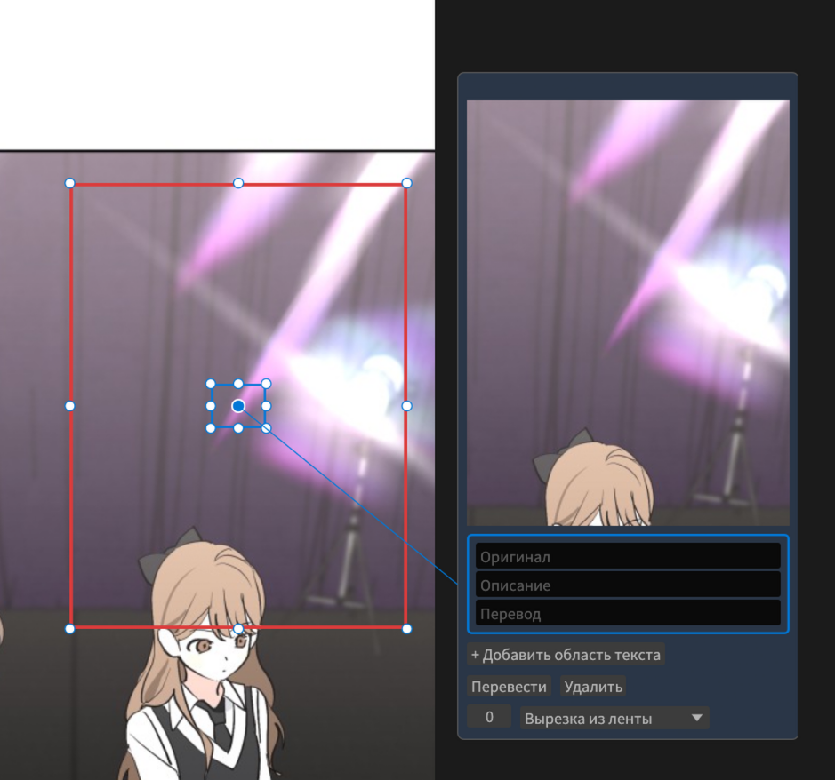
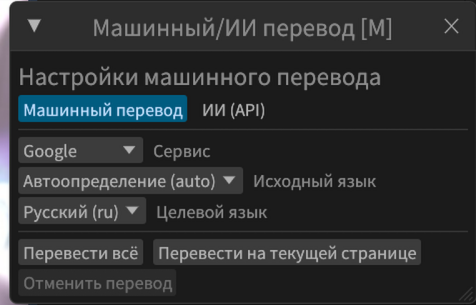
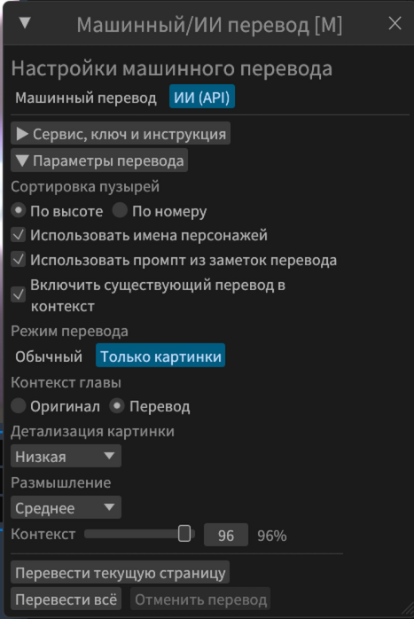

# Вкладка **Перевод**
### **Инструкции по переводу в конце**

Тут можно создавать текстовые пузыри, распознавать текст и вставлять перевод.

## **Текстовый пузырь**

Нужен для первичного перевода. Потом позволяет быстро вставить текст при тайпинге.

- Создается вручную клавишей T и исходит влево или вправо от точки на ленте, где был курсор в момент создания
- Может быть создан с помощью OCR, в таком случае в нем будет распознанный текст.
- Может быть удалён клавишей Del
- Может быть скопирован и вставлен на Ctrl+C и Ctrl+V, можно дублировать на Ctrl+D
- Можно перетаскивать
- **Верхняя строка** - оригинальный текст
- **Нижняя строка** - перевод. В отличии от остальных элементов, которые присутствуют только во вкладке перевода, эта строка будет в каждой вкладке.
- Номер, в данном случае `42`, это номер реплики для тех случаев, когда порядок реплик не сверху вниз. Например для манги. Будет использовано в компоновке перевода.
- Строка после номера, в данном случае `Ведущий`, это имя персонажа, который говорит, или другое описание реплики, например `мысли главного героя`, или `подпись`. Строка имеет автодополнение, предлагая имена персонажей, созданных в соответствующей вкладке, или другие заготовки.
- Имеет такие кнопки:
  - `Перевести`: Переводит верхнюю строку и вставляет результат в нижнюю строку. Используется сервис, выбранный на панели машинного перевода.
  - `Удалить:` Удаляет текстовый пузырь

## **Пузырь с картинкой**

### **В основном нужны для ИИ перевода через API**
- Создаются на `Q` или выделением `Shift+Q`
- Могут содержать фрагмент страницы внутри красного выделения, или стороннюю картинку
- `Описание` заполняется вручную и объясняет ИИ, что это
- `Оригинал` и `Перевод` заполняет ИИ
- Могут иметь сразу несколько областей для текста внутри красной рамки.
  - Вне вкладки перевода это будут отдельные пузыри

## **Быстрая вставка имени персонажа**

Вверху ленты отображаются 6 последних использованных имён.
Чтобы быстро вставить 1 из них, зажмите нужную цифру от 2 до 6 вместе с горячей клавишей создания пузыря или выделения. Например `4 + T` или `Shift + 2 + ЛКМ` 

## **Распознавание текста**

- `Shift+ЛКМ` выделяет область на ленте тайтла, где будет распознан текст

### EasyOCR
Более простой и универсальный движок, поддерживает множество языков.

### PaddleOCR
Продвинутый OCR от китайских инженеров, хорош для китайского, японского, английского и корейского. Но может не у всех запустится.

### MangaOCR
Только японский OCR, специально обученный на манге. Зачастую сразу учитывает чтение справа-налево для столбцов.

### Surya
Самый большой движок распознавания текста, не требует выбор языка. Где-то может быть точнее, но работает дольше всех.

### AI API
Попросите ChatGPT или DeepSeek распознать сложный текст. Самый дорогой и точный метод.

### PaddleOCR-VL
Что-то среднее между Surya и PaddleOCR

### Настройки
- `Сохранять переносы строк` - Понятно по названию
- `Копировать в буфер` - Стоит ли копировать в буфер обмена распознанный текст
- `Столбцы справа налево` - Полезно при работе с мангой, где японский текст часто в виде столбцов, читающихся справа налево. Если включить, то порядок распознанных строк будет отражен.
- `Создавать пузырь` - Стоит ли создавать пузырь с распознанным текстов в центре выделенной области
- `Заменять символы` - Вручную настройте, что на что заменять. По умолчанию заменяет точки посередине строки на обычные, и троеточие на три отдельные точки

## **Компоновка перевода**

Упрощает составление реплик для ИИ.

**Настройки панели компоновки**

- `Сортировка`:
  - `По высоте` - Чем ниже в ленте текстовый пузырь, тем позже он будет вставлен. Номер реплики не имеет значения. Обычно для вертикального формата комиксов.
  - `По номеру реплики` - Игнорирует высоту и смотрит на номер реплики.
- `Скопировать` - копирует компоновку в буфер обмена
- `Обновить` - Обновляет компоновку, но обычно это не нужно, тк происходит при открытии панели.
- `Заменить \n` - На что заменять переход строки в пузырях. Обычно это пробел, но может кому-то понадобится явно разграничить строки, например если OCR дает неверный порядок.
- `Оборачивать реплики` - думаю и так понятно
- `Префикс реплики` - что вставлять перед каждой репликой
- `Лимит символов` - До какого количества символов делать компоновку. Реплики последнего персонажа будет вставлены полностью, даже если лимит превышен.
- `Использовать имена персонажей` - Если отключено, просто соберёт реплики, только обернув их в обратный апостроф.
- `Объединять реплики персонажей` - Если включено, вставлять между репликами одного персонажа следующий параметр
- `Между репликами одного персонажа` - По умолчанию одна новая строка
- `Между репликами` - Что вставлять между репликами, если персонажи разные. По умолчанию две новые строки.

### **MiniJinja**

Позволяет сделать какую угодно компоновку реплик. Дайте ИИ доступные параметры из первого текстового поля, попросите написать нужный шаблон, и вставьте во второе поле.

## **Массовый детектор текста**

Почти как у BallonsTranslator. Находит блоки текста и выделяет их синим, строки зелёным, и маску для клина красным.
Имеет такие параметры:

- `Алгоритм`: Классический чаще срабатывает ложно и не генерирует маску. ИИ же у некоторых может работать дольше, но часто находит текст лучше, и генерирует маску, которую в дальнейшем можно использовать для быстрого клина.
- `Показывать найденные блоки` - скрыть или показать зелёную обводку строк и синие блоки
- `Показывать маску` - скрыть или показать красную маску текста
- `Расширение блока` - насколько в каждую сторону расширить каждую зелёную строку. Рекомендуется 5-10
- `Дистанция объединения` - На каком расстоянии строки будут объединяться в блоки. Рекомендовано 5
- `Распознать` - Использовать загруженный движок распознавания, чтобы распознать текст в областях, выделенных синей рамкой.

## **Машинный перевод**

### **Настоятельно НЕ рекомендуется использовать для публичного перевода.**
- Можно использовать, чтобы быстро почитать самому
- Для публичного перевода лучше используйте такие ИИ как ChatGPT, Gemini, DeepSeek и прочие, а так же панель компоновки.

## **AI API**

- Автоматически отправляет контекст тайтла и реплики в выбранный ИИ
- Позволяет переводить только картинки
- Качество уже приемлемое для публичного перевода
  - Но всё же качество лучше, если вручную отправлять скомпонованные реплики в Gemini и потом вставлять их, так лучше получается параллельно редактировать

Поддерживает пока только Google и Яндекс, Deepl пока не работает.

## **Панель пузырей**

Позволяет быстро искать и редактировать перевод

## **Массовый детектор текста**

Позволяет быстро найти текст, но не указывает персонажей автоматически. Хорошо подходит, чтобы выделить весь текст а потом машинно его перевести, чтобы почитать самому.

## **Как переводить**
- Вставляете ИИ инструкцию из вкладки `Заметки Перевода`
- Распознаете оригинальный текст. То, что не распознается, например очень кривые шрифты, лучше оставить на потом, или сразу дать скриншот ИИ.
- Указываете, кто где говорит
- Вставляете в ИИ скомпонованные реплики
- Вставляете переведенный ИИ текст в текстовый пузырь на нужном месте через `ПКМ` -> `Вставить в перевод`
- Таким образом переводите основной текст
- Затем, отдельно делаете скриншоты кривого текста/звука и переводите через ИИ, создавая на T новые пузыри

В целом, можете переводить как хотите, своим знанием языка или обычным переводчиком, но если не знаете язык, то лучше используйте ИИ.