# **Вкладка Текст**
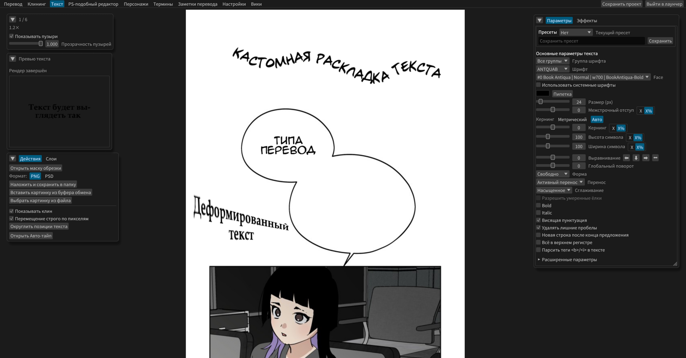
Позволяет размещать картинки текста на ленте

## **Принцип работы**
- Выделяете область для текста через `Shift+ЛКМ`
- Открывается окно редактирования, куда вставляется текст из оказавшегося в области выделения пузыря
- После потери фокуса (клик в сторону), окно редактирование закрывается, и создается картинка текста с нужными параметрами
- Картинку можно двигать перетаскиванием 
- Картинку можно масштабировать клавишами `-` и `=`
- Картинку мощно вращать, если навести курсор и `Ctrl+Колесо мыши`
- Можно регулировать размер шрифта на `Shift+колесо мыши`

## **Панель параметров**
### **Превью текста**

Отображает, как будет выглядеть текст при текущих параметрах, без учёта размера шрифта. Обновляется автоматически.

### **Основные параметры текста**
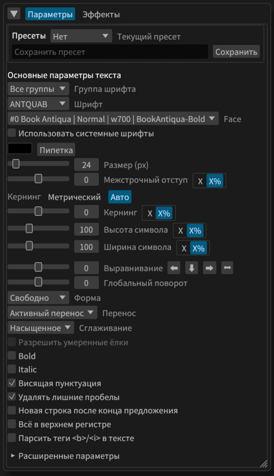

- `Пресет`: Сохраняйте и загружайте установленные параметры для каждого шрифта.
- `Шрифт`: С программой идёт несколько шрифтов, они показаны в выпадающем списке. Можно добавить свои, закинув ttf/otf файл в папку fonts
- `face`: выбор шрифта из семейства, если он не один
- `Использовать системные шрифты`: По умолчанию шрифты грузятся только из папки fonts рядом с установкой программы
- `Группа шрифта`: Ограничьте показываемые шрифты теми, что лежат в `fonts/groups/<название группы>`. Шрифты можно дублировать.
- `Размер`: Размер шрифта
- `Межстрочный отступ`: Отступ между строками текста в пикселях. Может быть отрицательным.
- `Кернинг`: `Метрический` - всегда одинаковое расстояние между буквами. `Авто` - использовать пары символов из шрифта, например `AV`, чтобы некоторые символы были ближе. Работает не со всеми шрифтами.
- `Кернинг Х`: Дополнительное расстояние между символами
- `Высота/Ширина символа`
- `Выравнивание`: Слева, справа, посередине или свободно. Можно двигать слайдер для промежуточной позиции.
- `Глобальный поворот`: Поворачивает весь текст пока он ещё в векторном состоянии (не растрирован). Даёт заметно более чёткую картинку, чем обычный поворот.
- `Форма`: Принцип компоновки строк, подробнее ниже.
- `Перенос`: Автоматический перенос текста для соблюдения формы. Регулирует его интенсивность или отключает.
- `Сглаживание`: Аналогично сглаживанию в фотошопе. Влияет на четкость текста.
- `Разрешить умеренные ёлки`: Влияет на форму текста. Разрешает провалы в форме.
- `Bold`: **Жирный шрифт**, работает не со всеми шрифтами
- `Italic`: Наклоненный шрифт, работает не со всеми
- `Висящая пунктуация`: Символы пунктуации автоматически не задеваются выравниванием текста. Список символов можно найти в настройках, но там почти все.
- `Удалять лишние пробелы`: Удаляет пробелы по краям строк.
- `Новая строка после конца предложения`
- `Всё в верхнем регистре`
- `Парсить теги`: Позволяет выделить конкретную часть текста в `<b>` или `<i>`, чтобы сделать только часть текста такой. Пример: `Жирным будет только <b>одно</b> слово`. Сейчас это автоматизировано, просто выделите текст, измените доступные параметры, и он обернется в теги.

### **Расширенные параметры текста**

- `Строка`: Может быть горизонтальной (как обычно), и вертикальной.
  - Для вертикальной доступно как справа налево, так и слева направо.
- `Раскладка строки`: Обычная и формула. Формула позволяет сделать любую форму.

### **Дополнительные параметры текста**
Доступны не всегда.

#### **Параметры только для выделенного текста**
- `Смещение X/Y`: Смещение символа или группы
- `Смещение по линии`: Если текст использует кастомную или формульную раскладку, то смещает выделенные символы вдоль неё
  - `Сдвигать следующие символы`: Только для смещения по линии. Следующий текст будет двигаться вместе с выделенным участком.
- `Поворот символа`: В выделенном тексте поворачивает каждый символ отдельно
- `Поворот группы`: Поворачивает весь выделенный текст вместе
- `Не разрывать`: Текст не разорвется при автоматическом переносе.

## **Панель редактирования текста**
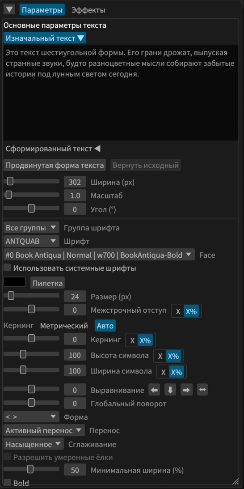

Появляется при выделении картинки текста. Похожа на панель создания текста, но имеет текстовое поле. Изменения сразу применяются.

**Часть текста можно выделить, менять доступные параметры, и это автоматически создаст инлайн-теги.**

## **Форма текста**
Хотя, корректнее назвать это быстрой формой.

Текст пытается уложится в эту форму, избегая ёлок и используя умный перенос.

Текст может быть такой формы:
- `Свободный`: Размещается как обычно.
- `[ ]`: Квадратный
- `( )`: Овальный
- `< >`: Шестиугольный
- Последние 2 формы имеют параметр минимальной ширины. Чем выше он, тем шире верх и низ текста.

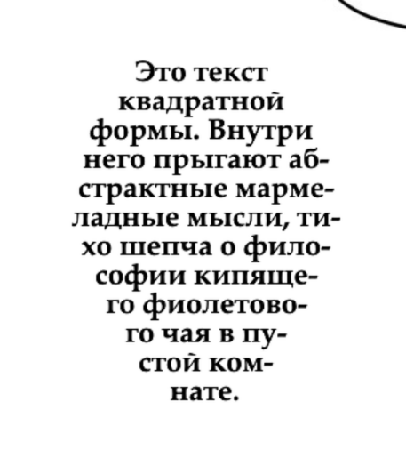
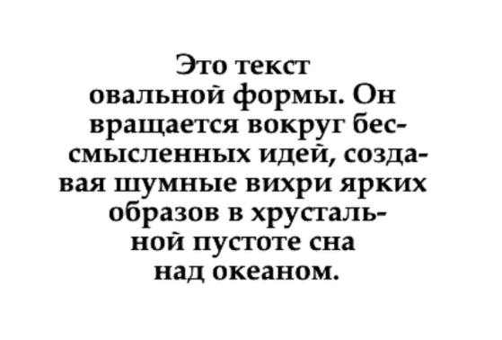
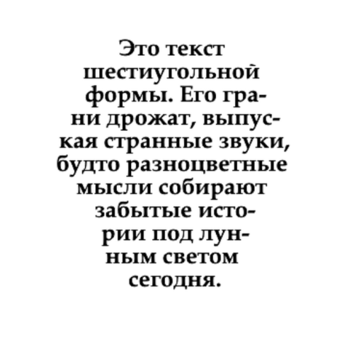

Как видно, формы не сильно отличаются. Но лучше используйте овальную.
Иногда силы переноса недостаточно, чтобы уложить текст в форму. Тогда поиграйтесь с параметрами ширины, размера шрифта, минимальной ширины, силы переноса. Или выберите быструю форму, кликнув ПКМ по текстовому слою.

## **Продвинутая форма текста**
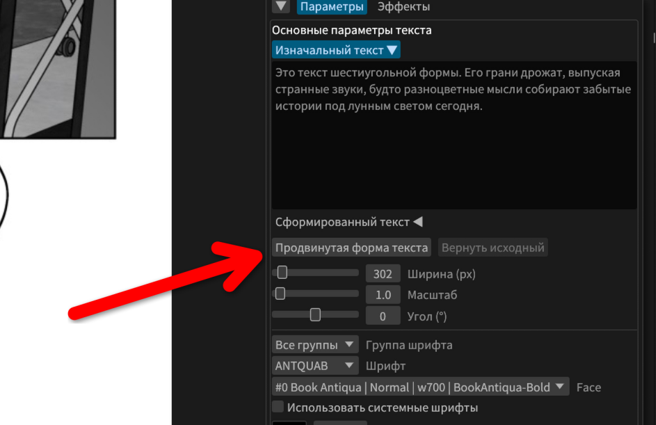
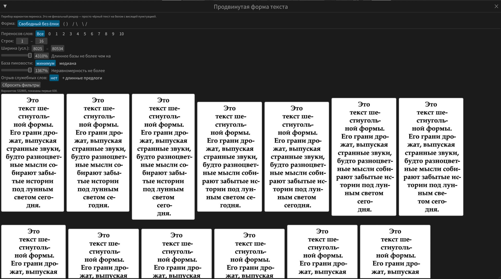

Можно найти на панели редактирования.
Показывает от нескольких до сотен тысяч возможных форм, которые без ёлок и с корректным переносом, которые можно фильтровать.
В отличии от быстрой формы, эта форма стабильная, и не изменится, пока не изменишь сам или не выберешь другую. Сохраняется при изменении шрифта и других параметров.

### Изначальный и сформированный текст
Когда применяется продвинутая форма, то программа для создания текстового слоя берёт уже не изначальный текст, а сформированный. Между ними можно переключатся. Сформированный текст можно править самому и добавлять теги. Но при повторном выборе формы программа снова возьмет изначальный текст для её расчета, и при выборе другой формы сформированный текст перезапишется.

## **Эффекты текста**

### **Обводка**

Обводит текст линией нужного цвета и толщины

### **Свечение**

Делает ауру вокруг текста

### **Тень**

Добавляет тексту тень с указанным смещением по X и Y

### **Градиент: 2 цвета**

Делает текст градиентным в нужном направлении

### **Градиент: 4 угла**

Добавляет тексту градиент на основе четырёх углов

### **Действия**
- `Обновить исходную картинку` - перезагружает текущую страницу на холсте. Нужно, если забыли что-то дочистить.
- `Показать текстовые пузыри` - возможность скрыть текстовые пузыри по бокам, чтобы лучше оценить итоговый перевод

### **Сохранение**
Сохраняет переведенный тайтл двумя способами. Рекомендуется сценовый рендер.

## **Маска обрезки**

Позволяет обрезать картинки текста. Если картинка текста касается маски, то она будет обрезана, и будут видны лишь находящиеся под маской части. Для каждого текста можно выключить обрезку в меню ПКМ.
Имеет прозрачно-жёлтый цвет, и не видна, когда эта панель закрыта.

### **Кисть маски**

- Включена по умолчанию, пока открыта панель
- На `ЛКМ` рисование, на `ПКМ` или `Shift+ЛКМ` ластик. Размер регулируется на `Ctrl+колесо`.

### **Заливка маски**

- Активируется, если нажать соответствующую кнопку на панели маски
- По щелчку ЛКМ начнёт заливать от точки клика, распозлаясь по похожему цвету с учётом отклонения

## **Трансформация текста (перспектива)**
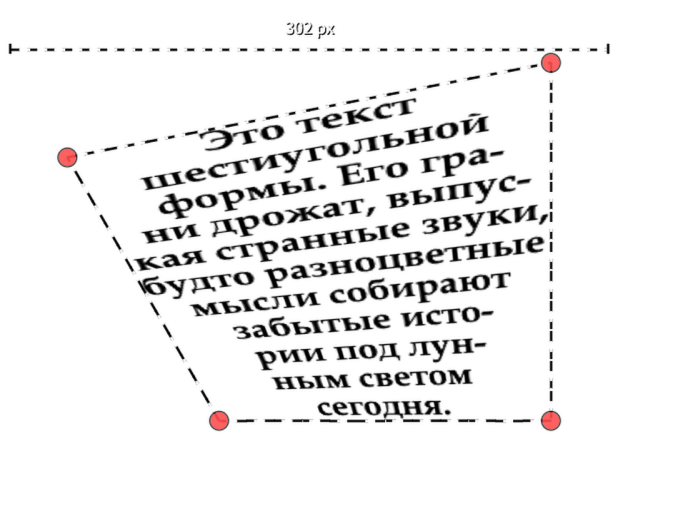
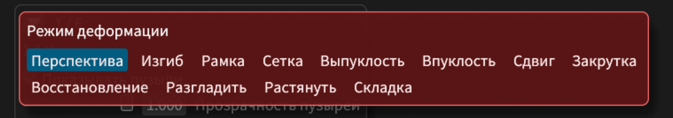

В режим трансформации можно войти, нажав ПКМ по выделенному тексту и выбрав соответствующий пункт в меню.
Позволяет деформировать текст не только для перспективы, перетягивая его за ручки.

## **Кастомная раскладка текста**
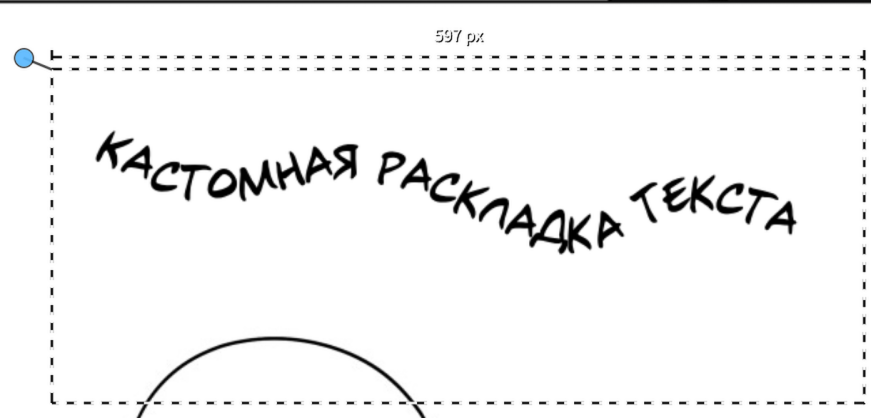
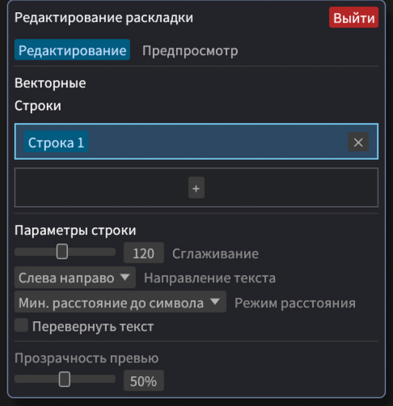
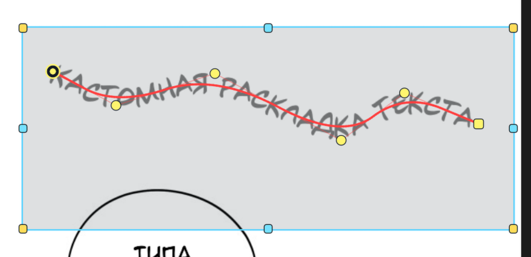

Полезная вещь для звуков.
**Чтобы начать, выберите в меню ПКМ текста пункт "Кастомная раскладка текста"**

**Этот режим не позволяет потерять фокус на тексте, нужно намерено нажать "Выйти"**

- Меняйте размер текста, перетаскивая область за углы
- Выбрав строку на панели, нажмите ЛКМ в области, чтобы добавить её начало
- На Shift+ЛКМ перетаскивайте квадратную точку, оставляя промежуточные точки, чтобы задать форму строки
- На ЛКМ просто перетаскивайте точки, меняя форму и не создавая новые
  - Большая круглая точка это начало строки
  - Маленькая круглая это промежуточная
  - Квадратная точка это конец, за неё строку можно расширять
  - Если точки и линия серые, значит сейчас выбрана другая строка
    - Если все точки и линии серые, значит выбранная строка ещё не создана, нажмите ЛКМ чтобы создать первую точку.

### **Механика**
- На каждую строку в этой раскладке приходится фрагмент текста между переносами строки. За раз можно создавать несколько похожих звуков

### **Панель**
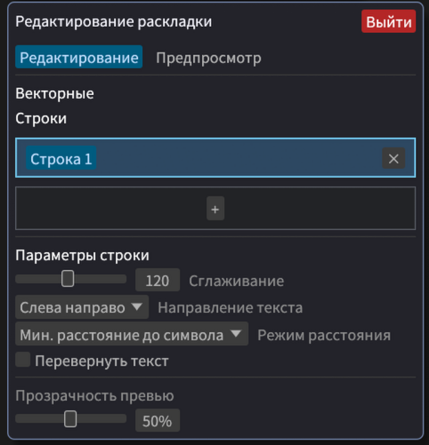

- Добавление и удаление строк
- Сглаживание (делает линию не угловатой)
- Направление и переворот текста
- Минимальное расстояние до символа: Просто по линии, или не допускать наложение символов

## **Добавление своих шрифтов**
В папке программы есть папка `fonts`, где лежат 4 основных шрифта - Anime Ace, для подписей, для звуков и Arial. Туда можно закинуть свои `.ttf`/`.otf` файлы.

## **Формульная раскладка текста**
Не знаю зачем, но это есть.
Формульная раскладка находится в `Расширенные параметры`:
- `Раскладка`: `Обычная` или `Формула`
- строка формул `x`, `y`, `rotation`
- кнопка `?` после формул (показать/скрыть шпаргалку по переменным и функциям)
- параметры траектории (`t_start/t_end`, `offset`, `scale`, `normal_offset`, `letter_spacing`)
- константы `a..h`

### **Как это работает**
Программа считает позицию и угол **каждого символа отдельно**.

Для каждого символа берётся параметр `t` (обычно от `0` до `1`), затем:
- `x = formula_x(...)`
- `y = formula_y(...)`
- `rotation = formula_rotation(...)` (в радианах)

После этого применяются смещения/масштабы и, при включении, поворот по касательной к траектории.

### **Параметры формульного режима**
| Параметр | Что делает | Как использовать |
|---|---|---|
| `Раскладка` | Переключает режим | `Обычная` для стандартной раскладки, `Формула` для дуг/спиралей/произвольных траекторий |
| `x` | Формула координаты X для каждого символа | Базовый старт: `t * w` |
| `y` | Формула координаты Y | Базовый старт: `120 * sin((t - 0.5) * pi)` |
| `rotation` | Дополнительный поворот каждого символа | `0` для без доп. поворота, `0.2*sin(2*pi*t)` для волны |
| `?` | Показывает/скрывает подсказку | Удобно, когда нужно быстро вспомнить переменные/функции |
| `Поворот по касательной` | Поворачивает символ вдоль направления кривой | Включайте для дуг/спиралей, выключайте для «ровного» текста на кривой |
| `t_start` | Начало диапазона параметра `t` | Обычно `0` |
| `t_end` | Конец диапазона `t` | Обычно `1`, увеличивайте для «большей длины» кривой |
| `offset_x` | Сдвиг всей траектории по X (px) | Подвинуть всю надпись вправо/влево |
| `offset_y` | Сдвиг всей траектории по Y (px) | Подвинуть всю надпись вверх/вниз |
| `scale_x` | Масштаб траектории по X | `>1` растягивает, `<1` сжимает |
| `scale_y` | Масштаб траектории по Y | Управляет амплитудой по вертикали |
| `normal_offset` | Сдвиг символов по нормали к кривой | Полезно, чтобы вынести текст наружу/внутрь окружности |
| `letter_spacing` | Множитель расстояния между символами | `1` норма, `>1` разрежает, `<1` уплотняет |
| `a..h` | Пользовательские константы для формул | Храните в них «ручки» для амплитуды, радиуса, количества витков и т.п. Но это только числа, в них нельзя ввести формулу. |

### **Переменные в формулах**
- `t` — текущая позиция по диапазону (`t_start..t_end`)
- `u` — центрированная позиция (`-1..1`)
- `i` — индекс символа
- `n` — количество символов
- `s` — накопленная длина по строке (в пикселях)
- `line` — индекс строки
- `line_t` — позиция символа внутри текущей строки (`0..1`)
- `line_n` — количество символов в текущей строке
- `w` / `width` — ширина блока текста (px)
- `fs` / `font_size` — размер шрифта
- `a..h` — ваши константы из UI
- `pi`, `tau`, `math_e` — математические константы

### **Доступные функции**
`sin`, `cos`, `tan`, `asin`, `acos`, `atan`, `atan2`, `sqrt`, `abs`, `exp`, `ln`, `log`, `min`, `max`, `clamp`, `pow`, `rad`, `deg`, `floor`, `ceil`, `round`, `sign`

### **Важно про угол**
- `rotation` задаётся в **радианах**
- если удобнее в градусах, используйте `rad(градусы)`, например: `rad(25)`

### **Готовые примеры (копируйте как есть)**
#### 1) Ду́га
- `x`: `t * w`
- `y`: `120 * sin((t - 0.5) * pi)`
- `rotation`: `0`
- `Поворот по касательной`: `вкл`

#### 2) Наклонная линия
- `x`: `t * w`
- `y`: `0.35 * t * w`
- `rotation`: `0`
- `Поворот по касательной`: `выкл`

#### 3) Волна
- `x`: `t * w`
- `y`: `80 * sin(2 * pi * t)`
- `rotation`: `0.15 * sin(2 * pi * t)`
- `Поворот по касательной`: `выкл`

#### 4) Спираль (через `a`, `b`, `c`)
- `a = 40`, `b = 180`, `c = 3`
- `x`: `(a + b * t) * cos(c * tau * t)`
- `y`: `(a + b * t) * sin(c * tau * t)`
- `rotation`: `0`
- `Поворот по касательной`: `вкл`

#### 5) Экспонента
- `a = 3`
- `x`: `t * w`
- `y`: `140 * (exp(a * t) - 1) / (exp(a) - 1)`
- `rotation`: `0`
- `Поворот по касательной`: `вкл`

### **Быстрый старт (чтобы не сломать компоновку)**
Поставьте базовые значения:
- `t_start = 0`
- `t_end = 1`
- `offset_x = 0`
- `offset_y = 0`
- `scale_x = 1`
- `scale_y = 1`
- `normal_offset = 0`
- `letter_spacing = 1`

И только потом меняйте по одному параметру.