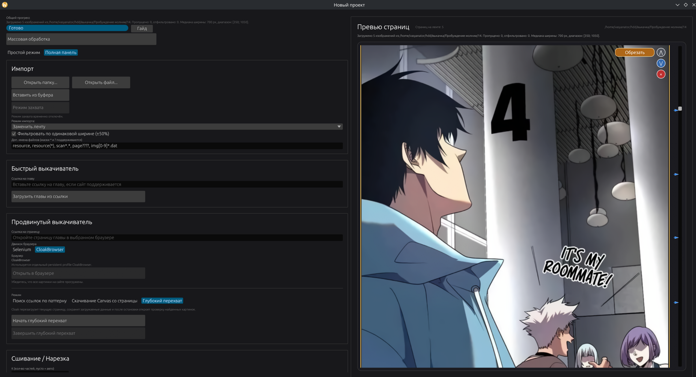
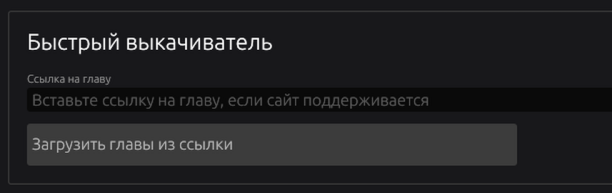
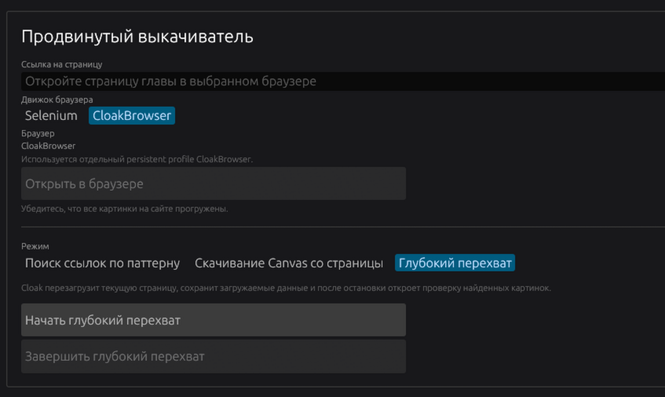
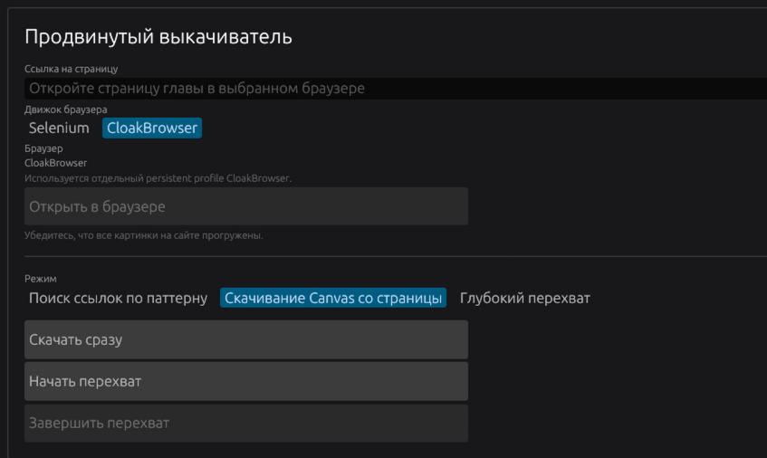
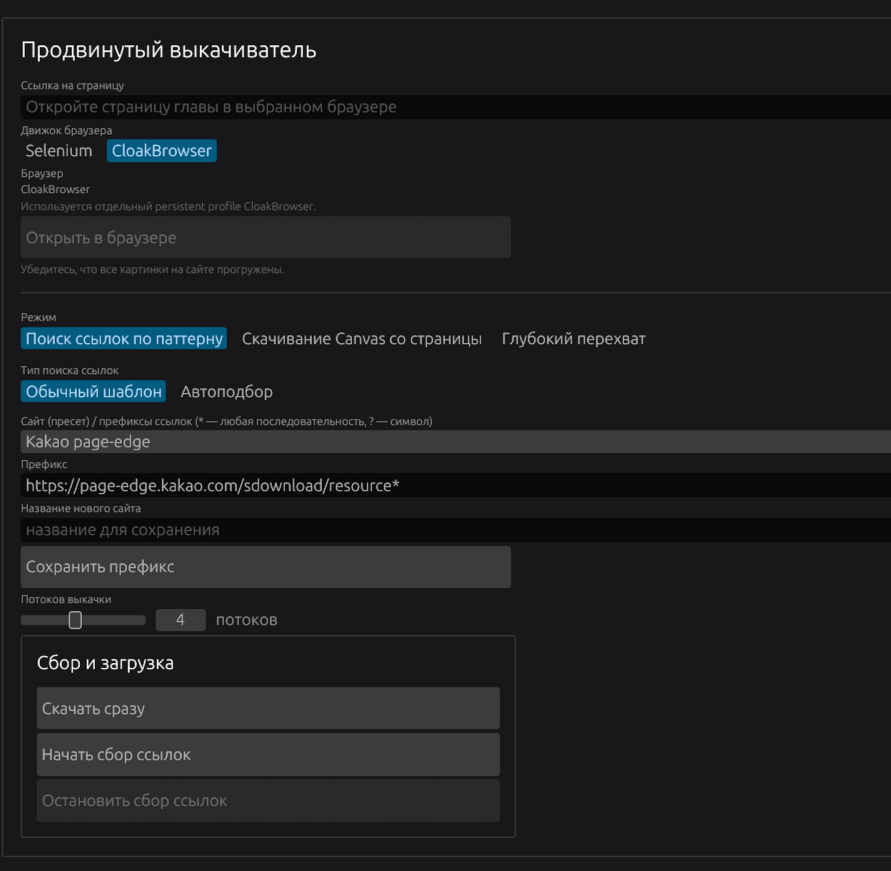
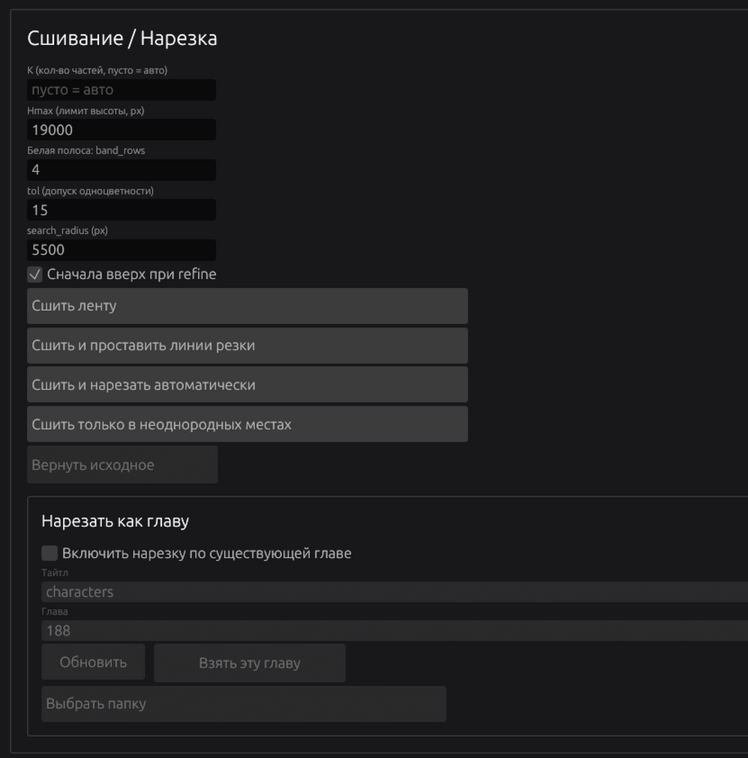
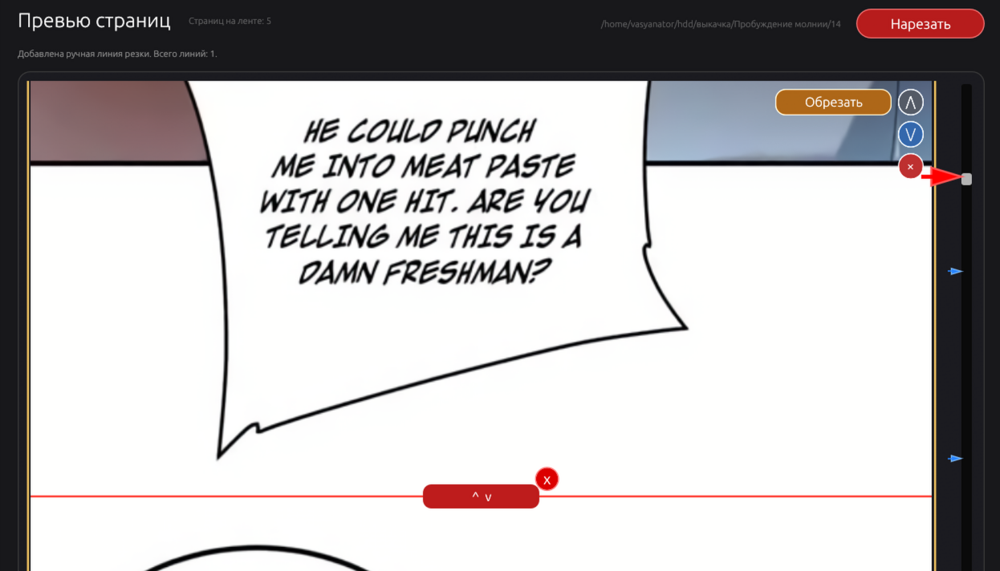
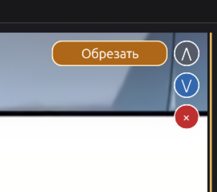
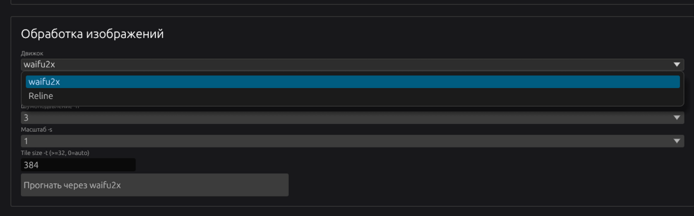
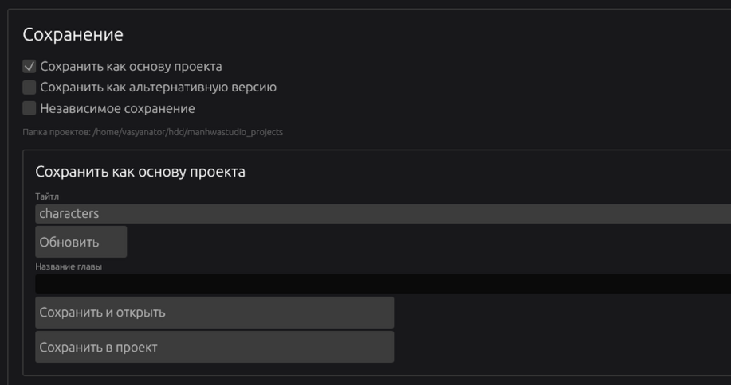

# Окно **Новый Проект**

Скачивает главу с разных сайтов и предварительно обрабатывает.

## Массовая обработка
Массовое выкачивание и обработка глав на основе графа узлов. Пока недопиленное и без полировки. Работает частично. Не обращайте внимание.

## **Импорт**
Кнопка `Открыть папку` позволяет открыть папку с картинками манхвы и импортировать их.

- Можно открыть папку с уже выкачанной главой, в таком случае картинки должны называться в правильном порядке, например `1.png/jpg/jpeg`
- Можно открыть сохраненный в основном браузере сайт с главой. 
  - В таком случае программа исследует лежащий на уровень выше `html` файл с названием папки, и загрузит картинки в том же порядке, в каком они были на странице.
  - Если HTML файл не найден, программа попытается загрузить картинки или `resource(X)` как картинки в порядке названия.
  - Можно задать паттерн названия файлов, если файлы картинок называются необычно
- Фильтр по +-50% ширины хорошо работает с комиксами вертикального формата, помогая убрать картинки рекламы, но **его лучше отключить для манги и других страничных комиксов**, иначе могут исчезнуть страницы

Кнопка `Открыть файл` позволяет открыть отдельную картинку, архив, или html файл скачанного сайта.

Кнопка `Вставить из буфера` позволяет вставить одну скопированную картинку.

`Режим добавления` - переключите, чтобы не стереть ленту полностью, добавляя забытую картинку.

## **Быстрый выкачиватель**

- Строка для ввода вверху и кнопка выкачки позволяют быстро скачать бесплатную главу с comic.naver.com, **!Не с series.naver.com!**
- Наведитесь на кнопку выкачки, чтобы посмотреть поддерживаемые сайты.

## **Продвинутый выкачиватель**

Открывает указанную страницу в полноценном браузере и выкачивает картинки выбранным способом.

### **Глубокий перехват**
Наиболее простой и универсальный режим, который работает даже с сложными сайтами. Но он **работает только с CloakBrowser**, и выкачивает со страницы всё что выглядит как картинка. **После его работы откроется окно, и нужно вручную отключить не относящиеся к главе картинки, например рекламу.**

## **Скачивание Canvas со страницы**
Его функционал уже встроен в глубокий перехват, можно не трогать. Скачивает картинки в том случае, если они являются `<canvas>` а не ``.

## **Поиск ссылок по паттерну**
Более чистый, но геморный метод, который работает не везде. **НУЖНЫ БАЗОВЫЕ НАВЫКИ ЛАЗАНИЯ В КОДЕ СТРАНИЦЫ**, гайд внизу этой вики.

Ищет ссылки по шаблону префикса:
- `*` означает любую комбинацию символов
- `?` означает любой один символ
- Это префикс, так что важно его начало. Нестабильный конец можно не писать.

Префиксы можно сохранять и загружать.

### Сбор ссылок
Помогает, если на странице появились не все картинки за раз. Например, сайт их грузит в процессе, или постраничная читалка.

**В таком случае начинайте сбор, пролистайте всю главу, и остановите сбор.**

### Потоки выкачки
Многопоточная выкачка в разы быстрее, но работает не всегда. Если картинки приходится доставать, используя сессию браузера а не обычный запрос, то загрузка увы однопоточная.

## **Сшивание/Нарезка**

Сшивает все картинки в одну ленту, а потом разбивает их так, чтобы не резать по тексту и картинке. **!Не использовать для манги!**, только для манхвы/маньхуа и прочих комиксов в виде длинной ленты.

### **Параметры сшивания**
- `Количество частей`: На сколько частей разбивать ленту. Если пусто, то автоматически.
- `Hmax`: На части какой высоты (в пикселях) резать ленту при автоматическим разбитии.
- `Белая полоса`: Линию из скольких пикселей проверять на одноцветность при разметке мест резки. Если проще - насколько тонкой может быть полоска одного цвета, чтобы там можно было резать.
- `Допуск одноцветности`: Насколько сильно может отличатся цвет пикселей в месте, где можно резать. Стоит сделать побольше, если это сёдзё с кучей красивых картинок.
- `search radius`: Как далеко в обе стороны от намеченного места резки будет искаться подходящее место.

### **Режимы работы**
- `Сшить ленту` - просто сшивает в одну длинную ленту и ничего больше
- `Сшить и проставить линии резки` - Сшивает и отмечает места нарезки для ручного контроля. Про них ниже.
- `Сшить и нарезать автоматически` - Сшивает и сразу нарезает в оптимальных местах. Быстро, но лучше ручной контроль.
- `Сшить только в неоднородных местах` - Не режет, а только склеивает ленту там, где разрезы были только через картинку или текстуру

### **Сшивание нарезка вручную**
После `Сшить и проставить линии резки`, или ручного добавления линии резки, появляется такой интерфейс:

  - **Красная стрелка** отмечает линию разреза на скроллбаре
  - **Синяя стрелка** отмечает **уже существующий разрез**
  - **Красная линия** это и есть будущий разрез, его можно двигать и удалить
  - **Красная кнопка** `Нарезать` вверху применяет все точки разреза и пересобирает ленту

- Линию разреза можно добавить в меню ПКМ
- Так же, в меню ПКМ можно сшить текущую страницу со следующей и предыдушей

### **Другие действия со страницей**

Это меню действий в углу каждой страницы.
- Стрелки вверх и вниз меняют текущую страницу местами со следующей или предыдущей
- Крестик её удаляет
- Можно вручную обрезать страницу

## **Нарезать как главу**

Берёт за основу выбранную главу, и режет картинки точно так же. Нужно, чтобы скачать альтернативные версии для инструмента Штамп.

Если есть разница в общей высоте обеих глав, то откроется окно:

Тут необходимо убедится, что картинки совпадают. Картинка скачанной главы будет полупрозрачной. Нужно отрегулировать высоту так, чтобы было как на первой картинке, а не как на второй.

### **После этого нужно сохранить как альтер-версию для выбранной главы, указав название.**

## **Обработка изображений (Waifu2x/Reline)**

## Waifu2x

Устаревший, но все ещё работающий ИИ для удаления шума и апскейла. Проще и быстрее Reline

## Reline

Современный ИИ для удаления шума и апскейла. Имеет много разных моделей, в основном для манги. 

## **Сохранение**

Сохраняет обработанный тайтл в структуру проекта или просто в выбранную папку (независимое сохранение).

Если просто сохраняете первую главу, то выбирайте "Сохранить как основу проекта", вводите название, и жмите "Сохранить и открыть".

- Тайтл это и строка и выпадающий список. Можно ввести своё.

# Взлом сайта и создание префикса
На примере mto.to

## 1. Открываем главу в обычном браузере и жмём F12

## 2. Наводимся на разные HTML теги и браузер сам показывает, за что они отвечают. Если выделена часть сайта с картинкой главы - открываем тег, пока не дойдем до самой картинки.

## 3. Открываем тег с конкретной картинкой и смотрим, какая там ссылка.

### Например, тут у нас ссылка `https://n27.mbeaj.org/media/mbch/a97/6921b1dc4b5d85970424179a/128472992_800_14755_1072554.webp` Открываем её в новой вкладке и убеждаемся, что это картинка.

### Далее, открываем ещё несколько тегов с картинками и собираем ссылки. Например, вот:
- `https://n27.mbeaj.org/media/mbch/a97/6921b1dc4b5d85970424179a/128472992_800_14755_1072554.webp`
- `https://n25.mbuul.org/media/mbch/a97/6921b1dc4b5d85970424179a/128472994_800_12860_1448870.webp`
- `https://n21.mbrtz.org/media/mbch/a97/6921b1dc4b5d85970424179a/128473001_800_15000_1578696.webp`
- `https://n06.mbwww.org/media/mbch/a97/6921b1dc4b5d85970424179a/128473003_800_15000_1167770.webp`

## 4. Внимательно смотрим на ссылки, и ищем общее. Например вот:
- Например, субдомен всегда начинается с n
- В названии сайтов всегоа есть mb
- Первый раздел всегда /media
- Остальное, например `mbch/a97/6921b1dc4b5d85970424179a`, может меняться от тайтла к тайтлу

## 5. Вспоминаем, как работает мой упрощенный шаблон
- `*` означает любую комбинацию символов
- `?` означает любой одиночный символ

## 6. Составляем префикс-шаблон
- Берем начало ссылки, в данном случае `https://n06.mbwww.org/media/`
- Заменяем всё меняющееся на символы подстановки, например вместо `n06` будет `n*` или `n??`
- Добавляем в конец *
- Получается что-то такое: `https://n*.mb*.org/media/*`

## 7. Поздравляю! `https://n*.mb*.org/media/*` можно вставлять как префикс в продвинутый выкачиватель